# Sailen Mondal

```text
$ whoami
Sailen Mondal
$ role
Java Backend Developer
$ status
Building production systems on the terminal.
```

<picture>
  <source media="(prefers-color-scheme: dark)" srcset="assets/hero-dark.svg">
  <source media="(prefers-color-scheme: light)" srcset="assets/hero-light.svg">
  
</picture>

## GitHub Stats

```bash
$ gh api user --jq .login
Sailen-Mondal
```

<p align="center">
  
</p>

<p align="center">
  
</p>

<p align="center">
  
</p>

## Featured Projects

```bash
$ ls ~/projects
```

| Project | Description |
| --- | --- |
| [Career Copilot](https://github.com/Sailen-Mondal/Career-Copilot) | AI-powered career assistant with RAG and agent workflows |
| [WhatsApp AI Assistant](https://github.com/Sailen-Mondal/WhatsApp-AI-Assistant) | WhatsApp-integrated AI bot for automated conversations |

## Tech Stack

```bash
$ cat ~/.stack
```

            

## Contact

```bash
$ cat ~/.contact
```

| Channel | Link |
| --- | --- |
| GitHub | [Sailen-Mondal](https://github.com/Sailen-Mondal) |
| LinkedIn | [Profile](https://www.linkedin.com/in/sailen-mondal) |
| Email | [sailenmondal@gmail.com](mailto:sailenmondal@gmail.com) |

## Resume

[](https://github.com/Sailen-Mondal/Sailen-Mondal)

---

```bash
$ echo "Thanks for visiting" && exit 0
```
